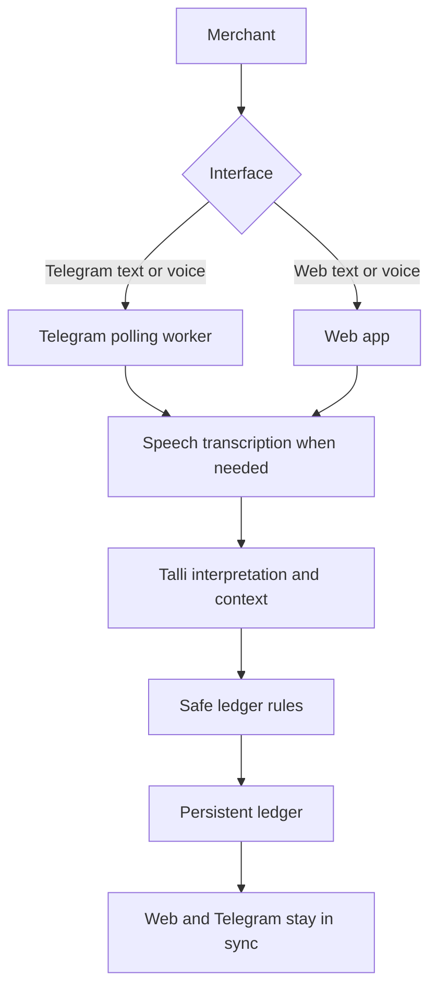

# Talli

> Send a voice note. Talli keeps the ledger.


[Try Talli Live](https://talli.onrender.com)

Talli is a voice-first conversational credit ledger for small businesses. It was built for the micro1 Agentic Workflows Hackathon by Esther Oyelalu. The product is the ledger. Voice and conversation are just the interface.

## The Problem

Many small businesses still track customer credit with notebooks, memory, chat messages, and handwritten notes. That works until it does not.

A notebook can get lost, damaged, torn, or have missing pages. Search becomes painful. Partial payments are easy to misread later. Messages get buried in long conversations. Memory is unreliable. When several customers owe money at different times, a simple question like "How much does Sarah still owe?" can turn into a hunt through old notes.

Traditional bookkeeping software can help, but it can also add too much work when the merchant only wants to say what happened and move on.

## The Solution

Talli starts from a simpler idea: keeping a proper credit record should be as easy as sending a voice note.

The merchant speaks or types naturally. Talli interprets the update, checks the existing ledger context, figures out what the message refers to, and only then applies a safe change. The updated balance and history are available on every connected Talli surface.

Talli is not just a chatbot. The ledger is the product. Conversation is how the merchant reaches it.

## How It Works

1. The merchant says or types an update.
2. Talli transcribes voice when needed.
3. Talli interprets the message using the current ledger and recent history.
4. Safe ledger rules decide whether the change is valid.
5. The ledger is updated and the new state is visible in both web and Telegram.

## What Talli Can Do

### Merchant Interfaces

| Capability | Where it exists |
| --- | --- |
| Web typed input | `public/app.js` posts updates to `/api/message` |
| Web voice input | Browser Web Speech API in the composer |
| Telegram text messages | `TelegramConversationService.handleTextMessage` |
| Telegram voice notes | `TelegramConversationService.handleVoiceMessage` |
| Telegram linking | One-time deep links from the web app |
| Telegram commands | `/help`, `/balance`, `/customers`, and `/start link_<token>` |
| Customer list | Web customer list and `/customers` output |
| Customer detail view | Web customer history, balances, and recent turns |
| Ledger overview | Web metrics and `/api/ledger` |

### Ledger Behaviors

| Capability | How it works |
| --- | --- |
| Persistent customer credit ledger | Append-only ledger events plus session state |
| Customer creation | New debts can create a customer when the name is not known yet |
| New credit / obligation recording | `CREATE_OBLIGATION` |
| Partial payments | `RECORD_PAYMENT` |
| Full settlement | `SETTLE_OBLIGATION` |
| Payment history | Payments remain in the event history |
| Outstanding balances | Recomputed from the event log |
| Due dates from natural language | Dates such as Friday, Monday, today, yesterday, and tomorrow are normalized against the reference clock |
| Corrections and amendments | `CORRECT_OBLIGATION` updates the original amount without erasing history |
| Historical and contextual references | `previousTurnId`, latest-open resolution, and recent-turn context |
| Customer / obligation resolution | Direct IDs, names, aliases, and candidate-based resolution |
| Ambiguity detection | Duplicate names or unclear references trigger clarification |
| Safe refusal when unclear | Talli asks instead of guessing when a change is unsafe |
| Deterministic ledger validation | The ledger rejects negative or inconsistent balances |
| Currency handling | User currency preference is tracked and conflicts are clarified |
| User isolation | Each merchant gets a separate session and storage scope |

### Telegram Commands

| Command | What it does |
| --- | --- |
| `/start link_<token>` | Connects a Telegram account to the same Talli ledger as the web session |
| `/help` | Shows the supported commands |
| `/balance` | Shows open balance summary |
| `/customers` | Lists customers and their outstanding balances |

## Example Credit Journey

1. Merchant says: `Sarah owes me 200 dollars.`
2. Talli records: Sarah owes $200.
3. Merchant later says: `Sarah paid me 50 dollars.`
4. Talli records the payment and Sarah now owes $150.
5. Merchant later says: `Sarah has paid back the 150 dollars.`
6. Talli settles the debt and keeps the history intact.

## Why an Agent?

The hard part is not only speech-to-text. The hard part is understanding how the new message relates to what already happened.

If the merchant says `Sarah owes me $200` and later says `Sarah paid $50`, the second message only makes sense if Talli remembers the first one. It has to know who the merchant means, whether this is a new debt or a payment, which existing obligation a payment belongs to, and whether there is enough information to change the ledger safely.

Talli uses AI for language and context understanding. It uses deterministic ledger rules for the actual financial state.

## Safety Principle

When the meaning is unclear, guessing is worse than asking.

Talli should not confidently change a credit record when it cannot safely tell what the merchant meant. In those cases it asks for clarification and leaves the ledger untouched.

## Architecture



Under the hood, the runtime is split into a few clear layers:

- `src/llm` builds the intent contract, retrieval context, prompts, and deterministic compiler.
- `src/domain` owns the ledger rules, money handling, and invariant checks.
- `src/app` hosts the HTTP API, persistence, demo helpers, and service orchestration.
- `src/integrations/telegram` handles linking, text, voice notes, and command handling.
- `src/integrations/transcription` handles OpenAI-compatible speech transcription.

## Ledger Design

Talli keeps the ledger as history, not just the latest balance.

- Money is stored in integer minor units.
- A payment does not erase the original debt.
- A correction updates the original obligation and keeps the payment trail.
- Clarification requests are recorded without mutating financial state.
- The ledger is validated after every mutation.

The domain events are simple and explicit:

- `customer.created`
- `obligation.created`
- `payment.recorded`
- `obligation.corrected`
- `decision.clarification_requested`
- `decision.no_action`

## Data and Storage

By default, Talli uses local file storage under `.talli-data`. If you set `TALLI_STORAGE_DRIVER=supabase`, it stores state in Supabase instead.

| Concept | What it stores |
| --- | --- |
| `talli_users` | One row per merchant / user scope |
| `telegram_links` | Telegram account to Talli user mapping |
| `ledger_events` | Append-only ledger history |
| `conversation_sessions` | Session state, recent turns, and pending clarification |
| `conversation_turns` | Turn-level records in the Supabase schema |
| `user_preferences` | Preferred currency |
| `web_sessions` | Web session cookies backed by persistent tokens |
| `link_tokens` | One-time Telegram deep-link tokens |

The Supabase migration also enables row-level security so user-scoped data stays isolated by `auth.uid()`.

## Tech Stack

- TypeScript for the application, domain logic, and benchmark harness.
- Node.js for the runtime and local scripts.
- Zod for runtime validation of actions, intents, and provider output.
- Vitest for unit, runtime, and benchmark tests.
- Biome for linting.
- `tsx` for local TypeScript execution during development.
- Plain HTML, CSS, and JavaScript for the web frontend.
- Web Speech API for browser voice input when available.
- Telegram Bot API for chat, linking, commands, and voice-note ingestion.
- OpenAI-compatible chat completions for interpretation.
- Groq for one supported interpretation / transcription path via OpenAI-compatible endpoints.
- OpenRouter as another supported OpenAI-compatible endpoint.
- Supabase/PostgreSQL for persistent shared storage when enabled.
- Render for the hosted web deployment.

For transcription, the current code defaults to `whisper-1` on OpenAI-compatible OpenAI endpoints and `whisper-large-v3-turbo` on Groq when no explicit transcription model is set.

## Evaluation

The benchmark is locked before evaluation. The ground truth does not move.

It contains 8 scenarios and 18 turns, all evaluated against the same fixed reference clock:

- `2026-08-29T09:00:00+01:00`
- `Africa/Lagos`

The eight scenarios cover:

- new credit
- partial payment
- settlement
- correction
- repeat customer, new obligation
- natural reference resolution
- ambiguity
- Nigerian Pidgin multi-turn handling

### Primary Metric

First, in plain English: after each turn, did Talli's ledger contain the correct financially meaningful state?

That includes the right customer, the right debt, the right payment, the right outstanding balance, the right settlement status, and the right due date when one was part of the update.

The formal name is `Ledger State Accuracy (LSA)`.

`Unsafe Mutation Rate (UMR)` asks a different question: when Talli should have stopped or asked for clarification, did it change the ledger anyway? Lower is better.

### Measured Results

These are the recorded results from the checked-in evaluation artifacts, not a claim about the product's final UI quality.

| Run | LSA | Action Accuracy | UMR | Notes |
| --- | ---: | ---: | ---: | --- |
| V1 baseline | 5.6% | 0% | 0% | Early rich-schema baseline; provider/schema failures dominated |
| V1 advanced | 5.6% | 0% | 0% | Early rich-schema advanced path; same failure profile |
| V2 baseline | 11.1% | 5.6% | 0% | Compact-intent baseline in the recorded artifact |
| V2 advanced | 5.6% | 0% | 0% | Compact-intent advanced path in the recorded artifact |
| Perfect control | 100% | 100% | 0% | Sanity check for the locked benchmark |
| Wrong control | 5.6% | 0% | 0% | Deliberately bad control |
| Unsafe control | 94.4% | 94.4% | 100% | Looked strong on accuracy but failed the ambiguity case |

The unsafe control is the important warning sign. A system can look good on overall accuracy and still make the dangerous decision when uncertainty matters. For a financial ledger, that is not acceptable.

### Benchmark Artifacts

- `artifacts/experiments/baseline-v1.json`
- `artifacts/experiments/advanced-v1.json`
- `artifacts/experiments/baseline-v2.json`
- `artifacts/experiments/advanced-v2.json`
- `artifacts/experiments/control-perfect-runtime.json`
- `artifacts/experiments/control-wrong-runtime.json`
- `artifacts/experiments/control-unsafe-runtime.json`
- `artifacts/experiments/contract-smoke.json`
- `artifacts/trajectories/`

## What Changed

1. The benchmark was locked first so evaluation had fixed ground truth.
2. V1 asked the model to output too much structured ledger detail. It was brittle and failed a lot at the provider / schema boundary.
3. V2 moved to a compact intent contract and let deterministic code do more of the ledger work. That changed the failure profile, even though the recorded advanced path still did not beat the simpler baseline in that run.
4. V3 added deterministic candidate retrieval before the model. The architecture was implemented, but live provider evaluation was blocked or inconclusive because of provider and rate-limit failures.
5. The product runtime added a persistent `TalliService`, session storage, a stable HTTP API, and a demo harness.
6. The web product added customer views, ledger views, browser voice input, typed input, and currency selection.
7. Explicit parsing was added for obvious financial statements so common updates do not depend entirely on provider availability.
8. Telegram linking, shared web / Telegram state, and voice-note ingestion made the product messaging-first.
9. Production hardening focused on user isolation, currency conflicts, disconnect / reconnect, safe transcription handling, and static asset serving.

## What Talli Taught Me

- Asking the model to output too much structured financial state was brittle.
- Provider and schema reliability became a real bottleneck.
- Letting the model own the whole ledger was the wrong abstraction.
- Aggregate accuracy can hide the one decision that actually matters.
- Simpler intent plus deterministic ledger logic is more dependable.
- Abstention is useful in financial workflows.

## Running Locally

### Prerequisites

- Node.js 22 or newer.
- npm.
- A `.env` file based on `.env.example`.
- Optional: Supabase if you want shared persistent storage.
- Optional: Telegram bot credentials if you want the Telegram worker.
- Optional: OpenAI-compatible provider credentials if you want live interpretation or transcription.

### Setup

```bash
npm ci
```

If you are changing dependencies, `npm install` is also fine. For a clean reproducible install, prefer `npm ci`.

### Start the Web API

```bash
npm run dev:api
```

The API serves the frontend too. The default local URL is `http://localhost:3000`.

### Start the Telegram Worker

```bash
npm run dev:telegram
```

Run this in a separate terminal. This worker polls Telegram locally and is the path that has been tested end-to-end in the repo.

### Optional Demo Commands

```bash
npm run demo
npm run demo:seed
npm run demo:reset
```

### Quality Checks

```bash
npm run typecheck
npm run lint
npm test
npm run build
```

### Evaluation Commands

```bash
npm run benchmark
npm run smoke:contract
npm run smoke:resolution
```

## Environment Variables

### Core Runtime

| Name | Purpose | Notes |
| --- | --- | --- |
| `SESSION_SECRET` | Required startup guard for the API | `npm run dev:api` fails fast if this is missing |
| `TALLI_TIMEZONE` | Default timezone for ledger dates | Defaults to `Africa/Lagos` |
| `TALLI_PORT` | API port override | Falls back to `PORT`, then `3000` |
| `PORT` | Hosting port override | Used when `TALLI_PORT` is not set |
| `TALLI_HOST` | API host override | Falls back to `HOST`, then `0.0.0.0` |
| `HOST` | Hosting host override | Used when `TALLI_HOST` is not set |
| `TALLI_STORAGE_DRIVER` | Chooses local files or Supabase | Set to `supabase` to enable the database backend |

### Ledger and Storage

| Name | Purpose | Notes |
| --- | --- | --- |
| `TALLI_DATA_DIR` | Local storage root | Defaults to `.talli-data` |
| `TALLI_LEDGER_FILE` | Override the local ledger file path | Local-file mode only |
| `TALLI_STATE_FILE` | Override the local session state file path | Local-file mode only |
| `TALLI_AUTH_FILE` | Override the local auth file path | Local-file mode only |
| `SUPABASE_URL` | Supabase REST endpoint | Required when `TALLI_STORAGE_DRIVER=supabase` |
| `SUPABASE_SERVICE_ROLE_KEY` | Supabase service-role token | Required when `TALLI_STORAGE_DRIVER=supabase` |

### Interpretation

| Name | Purpose | Notes |
| --- | --- | --- |
| `OPENAI_API_KEY` | OpenAI-compatible interpretation provider key | Required for live model-backed interpretation and benchmark runs |
| `OPENAI_MODEL` | Interpretation model name | Defaults to `gpt-5` |
| `OPENAI_BASE_URL` | OpenAI-compatible base URL | Can point to OpenRouter, Groq, or OpenAI-compatible gateways |

### Transcription

| Name | Purpose | Notes |
| --- | --- | --- |
| `TRANSCRIPTION_API_KEY` | Voice transcription provider key | Used for Telegram voice notes and any voice flow that needs transcription |
| `TRANSCRIPTION_BASE_URL` | Voice transcription base URL | Can point to Groq or another OpenAI-compatible endpoint |
| `TRANSCRIPTION_MODEL` | Voice transcription model name | Required for non-OpenAI and non-Groq endpoints |
| `OPENAI_TRANSCRIPTION_MODEL` | Alternate transcription model override | Optional alias supported by the transcription config |

### Telegram

| Name | Purpose | Notes |
| --- | --- | --- |
| `TELEGRAM_BOT_TOKEN` | Telegram bot token | Required for the Telegram polling worker |
| `TELEGRAM_BOT_USERNAME` | Telegram bot username | Used for deep links and the polling worker |

### Evaluation and Demo

| Name | Purpose | Notes |
| --- | --- | --- |
| `TALLI_INTERPRETER_MODE` | Selects benchmark interpreter mode | `baseline`, `advanced`, `perfect`, `wrong`, or `unsafe` |
| `TALLI_BENCHMARK_OUTPUT` | Benchmark output format | Set to `json` for machine-readable output |
| `TALLI_BENCHMARK_OUTPUT_PATH` | Writes benchmark JSON to a file | Optional artifact output path |
| `TALLI_TRAJECTORY_DIR` | Writes sanitized benchmark trajectories | Used by the benchmark runner |
| `TALLI_SMOKE_OUTPUT` | Overrides smoke-suite JSON output path | Used by the smoke commands |

## Supabase Setup

1. Create a Supabase project.
2. Run `supabase/migrations/001_talli_core.sql` in the SQL editor.
3. Set `TALLI_STORAGE_DRIVER=supabase`.
4. Set `SUPABASE_URL` and `SUPABASE_SERVICE_ROLE_KEY`.
5. Start the API again.

The schema is intentionally user-scoped. Each merchant gets isolated rows, and row-level security keeps that boundary in place.

## Telegram Setup

1. Start the web API.
2. Open the web app and click `Connect Telegram`.
3. Talli creates a one-time link token and a deep link.
4. Open the deep link in Telegram, which looks like `https://t.me/<bot>?start=link_<token>`.
5. Once linked, send text messages or voice notes to the bot.
6. Use `/help`, `/balance`, and `/customers` in the chat.
7. Disconnect from the web app if you want to unlink the Telegram account.
8. Generate a fresh link token if you want to reconnect later.

The local Telegram worker is wired end-to-end in this repository. The hosted web deployment does not imply that the polling worker is also live unless it is deployed separately.

## Testing

The repository currently contains 11 test files and 87 tests.

```bash
npm test
```

The suite covers:

- ledger operations
- partial payments and settlements
- corrections
- due dates
- ambiguity handling
- Telegram linking
- Telegram voice handling
- shared web / Telegram state
- user isolation
- static asset serving
- transcription provider configuration
- startup readiness
- benchmark controls and locked scenarios

In this environment, two long-running cases in `tests/app-runtime.test.ts` hit Vitest's default 5s timeout during `npm test`. The rest of the suite and the benchmark artifacts are still useful for inspection.

## Reproducing the Evaluation

1. Set the provider variables needed for live interpretation and, if you want voice, transcription.
2. Seed or reset the demo data if you want a known starting point.
3. Run `npm run benchmark` to execute the locked 8-scenario, 18-turn benchmark.
4. Use `TALLI_INTERPRETER_MODE=baseline|advanced|perfect|wrong|unsafe` to select the path.
5. Use `TALLI_BENCHMARK_OUTPUT=json` if you want machine-readable output.
6. Set `TALLI_TRAJECTORY_DIR` if you want sanitized trajectory JSON files written alongside the benchmark.
7. Run `npm run smoke:contract` and `npm run smoke:resolution` for the smaller provider smoke suites.

Expected output:

- a benchmark summary with mode, clock, scenario count, turn count, LSA, Action Accuracy, abstention-required turns, unsafe mutations, and UMR
- JSON artifacts in `artifacts/experiments/` when the smoke or benchmark scripts write outputs there
- optional trajectory JSON files in `artifacts/trajectories/`

## Project Structure

```text
src/domain              Ledger rules, money handling, and action types
src/llm                 Intent contract, prompts, retrieval, and deterministic compiler
src/app                 HTTP API, service runtime, storage, and demo helpers
src/integrations/telegram Telegram polling, link flow, commands, and voice-note handling
src/integrations/transcription OpenAI-compatible voice transcription
src/benchmark           Locked scenarios, evaluator, controls, and smoke suites
public                  Static web app, assets, and frontend JavaScript
supabase/migrations     Supabase/Postgres schema and row-level security
tests                   Ledger, runtime, Telegram, storage, and benchmark tests
artifacts               Checked-in benchmark artifacts and trajectories
```

## Privacy and Security

- Secrets stay in environment variables.
- The repository does not need real credentials committed to disk.
- Storage is scoped by user/session.
- Telegram accounts map to a specific Talli user through a one-time linking flow.
- Financial state only changes after deterministic validation.
- When provider output is unsafe or unclear, Talli refuses to guess.
- Web sessions are cookie-backed, and Telegram links are tracked separately from the ledger state.

## Limitations

- Talli is a credit ledger, not a bank or payment processor.
- It does not know that a debtor paid unless the merchant tells it or an integration provides that information.
- It does not move money on its own.
- WhatsApp is not implemented.
- Automatic debtor reminders are not implemented.
- No FX conversion between currencies is provided.
- The current benchmark and UI are demonstrated primarily in English, with Nigerian Pidgin flows also covered in the repo.
- This is a hackathon prototype, not regulated accounting software.

## Future Direction

- WhatsApp support
- Merchant-facing reminders
- Broader language coverage
- Optional payment integrations
- Richer business reporting

## Built By

Built by Esther Oyelalu

X: https://x.com/kunmiii__

Live: https://talli.onrender.com
